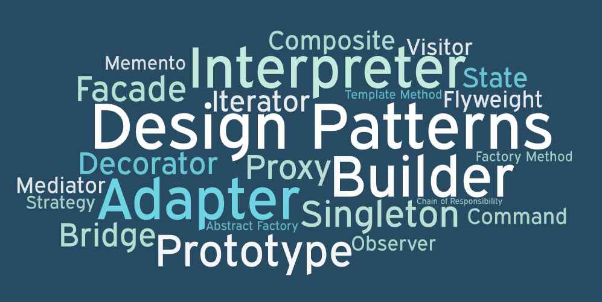

# 🎉 Design Patterns Playground 🎉



Welcome to the Design Patterns Playground! 🚀 This repository is a coding adventure where we explore various design patterns through fun and interactive katas. Let's dive into the world of elegant solutions and master the art of software design!

## 🌟 Table of Contents

- [👋 Introduction](#introduction)
- [🎨 Design Patterns](#design-patterns)
- [👩‍💻 Getting Started](#getting-started)
- [🚀 How to Contribute](#how-to-contribute)
- [📜 License](#license)

## 👋 Introduction

Design patterns are like the superheroes of software development, swooping in to save the day when we face recurring design challenges. In this playground, we turn learning into a game with small coding exercises known as katas. Get ready to level up your design pattern skills!

## 🎨 Design Patterns

Explore the universe of design patterns, organized by their superpowers:

### Creational Patterns

1. 🦸‍♂️ Singleton
2. 🏗️ Builder
3. 🏭 Factory Method

### Structural Patterns

1. 🔍 Observer
2. 🌲 Composite
3. 🌉 Bridge
4. 🔄 Adapter
5. 🎭 Decorator

### Behavioral Patterns

1. 🔄 State
2. 🎭 Strategy

Each design pattern has its own secret lair (directory) containing a README file with the pattern's backstory, use cases, and an example implementation as a kata.

## 👩‍💻 Getting Started

Embark on your coding quest:

1. Clone the repository:

   ```bash
   git clone https://github.com/your-username/design-patterns-katas.git
   ```

2. Choose a design pattern adventure:

   ```bash
   cd design-patterns-katas/singleton
   ```

3. Read the README file for the design pattern to unravel its mysteries.

4. Delve into the code, uncover the solution, and run any provided examples.

## 🚀 How to Contribute

Ready to be a hero? Join the league of contributors:

1. 🍴 Fork the repository.
2. 🌟 Create a new branch for your feature or bug fix:

   ```bash
   git checkout -b feature/new-pattern
   ```

3. 🚀 Make your changes, commit them, and soar to your fork:

   ```bash
   git commit -m "Add new pattern implementation"
   git push origin feature/new-pattern
   ```

4. 🎉 Open a pull request and join the hero hall of fame.

## License

This project is licensed under the ISC License. May the code be with you! 🚀✨
