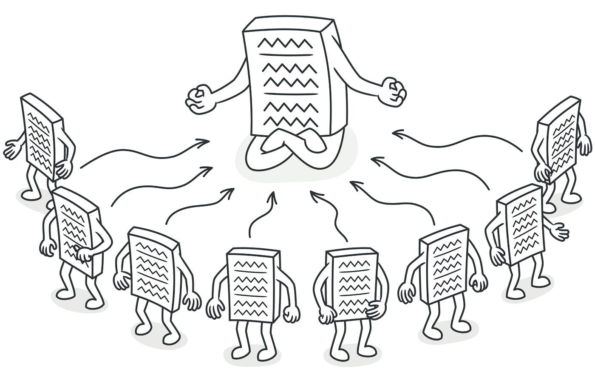

# Singleton Design Pattern



## Table of Contents

- [Introduction](#introduction)
- [When to Use](#when-to-use)
- [How it Works](#how-it-works)
- [Implementation](#implementation)
- [Usage](#usage)
- [Considerations](#considerations)
- [Example](#example)
- [Relationships with other patterns](#relationships-with-other-patterns)
- [License](#license)

## Introduction

The Singleton pattern restricts the instantiation of a class to a single instance and provides a global point of access to that instance. This is particularly useful when exactly one object is needed to coordinate actions across the system.

## When to Use

Use the Singleton pattern when:

- There must be exactly one instance of a class, and it must be accessible from a well-known point.
- The single instance should be extensible by subclassing, and clients should be able to use an extended instance without modifying their code.

## How it Works

The Singleton pattern involves a single class that is responsible for creating and managing its own instance. It ensures that only one instance of the class is created and provides a global point of access to that instance.

## Implementation

Here's a basic outline of how to implement the Singleton pattern:

1. **Private Constructor:** Make the class constructor private to prevent the direct instantiation of the class from outside.

2. **Static Instance:** Create a static method within the class that returns the instance of the class. This method checks if an instance already exists; if it does, it returns that instance; if not, it creates a new instance.

3. **Lazy Initialization (Optional):** You can use lazy initialization to create the instance only when it is first requested.

## Usage

To use the Singleton pattern:

1. **Access the Singleton Instance:** Use the static method provided by the Singleton class to access its instance.

```typescript
const singletonInstance1 = Singleton.getInstance();
const singletonInstance2 = Singleton.getInstance();

console.log(singletonInstance1 === singletonInstance2); // Output: true
```

In the example above, ***singletonInstance1*** and ***singletonInstance2*** will refer to the same instance of the Singleton class. This ensures that there is only one instance created throughout the application.

2. **Access Singleton Methods and Properties:**

```typescript
singletonInstance1.someMethod();
const result = singletonInstance2.someProperty;
```

You can now use the singleton instance to call its methods or access its properties.

Remember, the key is to always access the instance using the getInstance method to ensure you are working with the single instance created.

## Considerations

While the Singleton pattern has its benefits, it's important to consider some potential drawbacks:

- **Thread Safety:** Ensure that the implementation is thread-safe, especially in a multi-threaded environment.
- **Global State:** Be cautious about introducing a global state as it can lead to issues related to testing and maintenance.
- **Testing Challenges:** Singleton can introduce challenges in unit testing due to its global nature.
- **Violates Single Responsibility Principle (SRP):** Singleton can violate the SRP by combining the responsibility of managing the instance creation with the actual functionality of the class. This violates the principle of having one reason to change a class.

Remember to weigh the pros and cons carefully based on the specific requirements and architecture of your application.

## Example

```typescript

class Singleton {
  private static instance: Singleton | null = null;

  private constructor() {
    // Private constructor to prevent direct instantiation.
  }

  public static getInstance(): Singleton {
    if (!Singleton.instance) {
      Singleton.instance = new Singleton();
    }
    return Singleton.instance;
  }

  // Other methods and properties can be added as needed.
}

// Usage
const singletonInstance = Singleton.getInstance();
```

## Relationships with other patterns

The Abstract Factory, Builder, and Prototype patterns can all be implemented as Singletons.

## License

This project is licensed under the ISC License.
