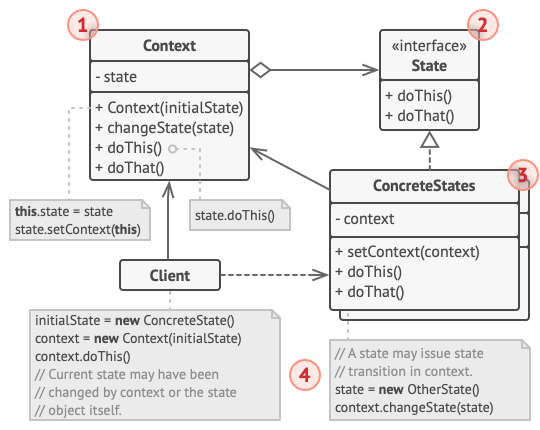

# State Design Pattern



## Table of Contents

- [Introduction](#introduction)
- [Goal](#goal)
- [When to Use](#when-to-use)
- [Example](#example)
  - [Context](#context)
  - [State Interface](#state-interface)
  - [Concrete States](#concrete-states)
  - [Concrete Context](#concrete-context)
  - [Usage](#usage)
- [Relationships with Other Patterns](#relationships-with-other-patterns)
- [License](#license)

## Introduction

The State pattern is a behavioral design pattern that allows an object to alter its behavior when its internal state changes. The object appears to change its class. This pattern is particularly useful in scenarios where an object's behavior depends on its state and must change dynamically.

## Goal

The main goal of the State pattern is to allow an object to behave differently based on its internal state. It achieves this by defining a family of state classes, encapsulating the behavior associated with each state, and allowing the object to switch between these states.

## When to Use

Use the State pattern when:

- The behavior of an object depends on its state, and the object must be able to change its behavior dynamically as its state changes.
- The class of an object should be changed dynamically at runtime.

## Example

Consider a scenario where there is a `TrafficLight` that can be in different states (Red, Yellow, Green), and its behavior (the action to be taken when the light changes) depends on its current state.

### Context

```typescript
// Context
class TrafficLight {
  private state: TrafficLightState;

  constructor() {
    this.state = new RedLight();
  }

  setState(state: TrafficLightState): void {
    this.state = state;
  }

  request(): void {
    this.state.handleRequest(this);
  }
}
```

### State Interface

```typescript
// State interface
interface TrafficLightState {
  handleRequest(light: TrafficLight): void;
}
```

### Concrete States

```typescript
// Concrete States
class RedLight implements TrafficLightState {
  handleRequest(light: TrafficLight): void {
    console.log("Red Light: Stop!");
    light.setState(new GreenLight());
  }
}

class YellowLight implements TrafficLightState {
  handleRequest(light: TrafficLight): void {
    console.log("Yellow Light: Proceed with caution.");
    light.setState(new RedLight());
  }
}

class GreenLight implements TrafficLightState {
  handleRequest(light: TrafficLight): void {
    console.log("Green Light: Go!");
    light.setState(new YellowLight());
  }
}
```

### Concrete Context

```typescript
// Concrete Context
const trafficLight = new TrafficLight();

// Initial state is Red
trafficLight.request();

// Transition to Green
trafficLight.request();

// Transition to Yellow
trafficLight.request();

// Transition back to Red
trafficLight.request();
```

### Usage

```typescript
// Changing the state of the TrafficLight will result in different behaviors
trafficLight.request();
```

## Relationships with Other Patterns

- **Strategy**: The State pattern is similar to the Strategy pattern, but they are used for different purposes. While both patterns define a family of algorithms, the State pattern focuses on changing the behavior of an object when its internal state changes, whereas the Strategy pattern focuses on encapsulating interchangeable algorithms.

- **Singleton**: The State pattern's states can sometimes be implemented as singletons, especially when the same state is reused across multiple contexts. Care should be taken to manage dependencies and avoid creating tightly coupled systems.

- **Command**: In some cases, the Command pattern can be combined with the State pattern. The Command pattern encapsulates requests as objects, and the State pattern allows an object to change its behavior based on its internal state using commands.

## License

This project is licensed under the ISC License.
