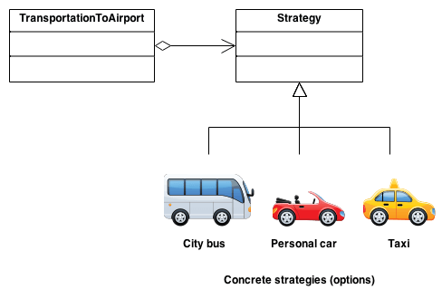

# Strategy Design Pattern



## Table of Contents

- [Introduction](#introduction)
- [Goal](#goal)
- [When to Use](#when-to-use)
- [Example](#example)
  - [Context Class](#context-class)
  - [Strategy Interface](#strategy-interface)
  - [Concrete Strategies](#concrete-strategies)
  - [Usage](#usage)
- [Relationships with Other Patterns](#relationships-with-other-patterns)
- [License](#license)

## Introduction

The Strategy pattern is a behavioral design pattern that defines a family of algorithms, encapsulates each algorithm, and makes them interchangeable. The pattern allows the client to choose the appropriate algorithm at runtime.

## Goal

The main goal of the Strategy pattern is to define a family of algorithms, encapsulate each one of them, and make them interchangeable. This enables the client to vary the algorithm it uses independently from the clients that use it.

For example: Consider a sorting algorithm. Using the Strategy pattern, different sorting algorithms (strategies) can be encapsulated, and the client can switch between them at runtime.

## When to Use

Use the Strategy pattern when:

- There are multiple algorithms for a specific task, and the client needs to choose between them dynamically.
- A class has a behavior that can be represented as an interface and multiple concrete implementations.

## Example

Consider a `SortingContext` class that performs sorting on an array. The sorting algorithm can be varied at runtime using the Strategy pattern.

### Context Class

```typescript
// Context class
class SortingContext {
  private strategy: SortingStrategy;

  constructor(strategy: SortingStrategy) {
    this.strategy = strategy;
  }

  setStrategy(strategy: SortingStrategy): void {
    this.strategy = strategy;
  }

  sort(data: number[]): number[] {
    return this.strategy.sort(data);
  }
}
```

### Strategy Interface

```typescript
// Strategy interface
interface SortingStrategy {
  sort(data: number[]): number[];
}
```

### Concrete Strategies

```typescript
// Concrete strategies
class BubbleSort implements SortingStrategy {
  sort(data: number[]): number[] {
    // Implementation of bubble sort
    return data.sort((a, b) => a - b);
  }
}

class QuickSort implements SortingStrategy {
  sort(data: number[]): number[] {
    // Implementation of quick sort
    return data.sort((a, b) => a - b);
  }
}

class MergeSort implements SortingStrategy {
  sort(data: number[]): number[] {
    // Implementation of merge sort
    return data.sort((a, b) => a - b);
  }
}
```

### Usage

```typescript
// Using the Strategy pattern
const sortingContext = new SortingContext(new BubbleSort());

const dataToSort = [3, 1, 4, 1, 5, 9, 2, 6, 5, 3, 5];

sortingContext.sort(dataToSort); // Output: [1, 1, 2, 3, 3, 4, 5, 5, 5, 6, 9]

sortingContext.setStrategy(new QuickSort());
sortingContext.sort(dataToSort); // Output: [1, 1, 2, 3, 3, 4, 5, 5, 5, 6, 9]
```

## Relationships with Other Patterns

- **State**: The Strategy pattern is similar to the State pattern, but they are used for different purposes. While both patterns define a family of algorithms, the Strategy pattern focuses on making these algorithms interchangeable, whereas the State pattern focuses on encapsulating state-specific behavior.

- **Template Method**: The Strategy pattern is similar to the Template Method pattern in that both involve algorithms. However, the Template Method uses inheritance to alter parts of an algorithm, while the Strategy pattern uses composition to switch between algorithms.

- **Command**: The Command pattern encapsulates a request as an object, allowing for parameterization of clients with different requests. The Strategy pattern encapsulates an algorithm, allowing for parameterization of clients with different strategies.

## License

This project is licensed under the ISC License.
